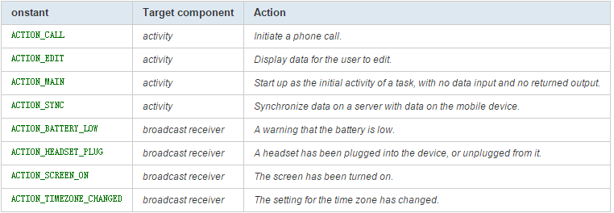

1.3 activity & intent
=====================
> 掌握activity生命周期

> 掌握activity切换数据的传递

# activity #
Android中，Activity是所有程序的根本，所有程序的流程都运行在Activity之中，Activity具有自己的生命周期。由系统控制生命周期，程序无法改变，但可以用onSaveInstanceState保存其状态）。对于Activity，关键是其生命周期的把握（如下图）：

其次就是状态的保存和恢复（onSaveInstanceState onRestoreInstanceState），以及Activity之间的跳转和数据传输（intent）。

Activity中常用的函数有SetContentView()、findViewById()、finish()、startActivity()，其生命周期涉及的函数有：

- void onCreate(Bundle savedInstanceState)
- void onStart()
- void onRestart()
- void onResume()
- void onPause()
- void onStop()
- void onDestroy()

注意的是，Activity的使用需要在Manifest文件中添加相应的<Activity>，并设置其属性和intent-filter。

# Intent #

Android中提供了Intent机制来协助应用间的交互与通讯，Intent负责对应用中一次操作的动作、动作涉及数据、附加数据进行描述，Android则根据此Intent的描述，负责找到对应的组件，将 Intent传递给调用的组件，并完成组件的调用。Intent不仅可用于应用程序之间，也可用于应用程序内部的Activity/Service之间的交互。因此，Intent在这里起着一个媒体中介的作用，专门提供组件互相调用的相关信息，实现调用者与被调用者之间的解耦。在SDK中给出了Intent作用的表现形式为：

- 通过Context.startActivity() orActivity.startActivityForResult() 启动一个Activity；
- 通过 Context.startService() 启动一个服务，或者通过Context.bindService() 和后台服务交互；
- 通过广播方法(比如 Context.sendBroadcast(),Context.sendOrderedBroadcast(),  Context.sendStickyBroadcast()) 发给broadcast receivers。

**Intent属性的设置，包括以下几点：（以下为XML中定义，当然也可以通过Intent类的方法来获取和设置）**

- Action，也就是要执行的动作  
SDk中定义了一些标准的动作，包括  

> 当然，也可以自定义动作（自定义的动作在使用时，需要加上包名作为前缀，如"com.example.project.SHOW_COLOR”），并可定义相应的Activity来处理我们的自定义动作。

- Data，也就是执行动作要操作的数据 
Android中采用指向数据的一个URI来表示，如在联系人应用中，一个指向某联系人的URI可能为：content://contacts/1。对于不同的动作，其URI数据的类型是不同的（可以设置type属性指定特定类型数据），如ACTION_EDIT指定Data为文件URI，打电话为tel:URI，访问网络为http:URI，而由content provider提供的数据则为content: URIs。

- type（数据类型），显式指定Intent的数据类型（MIME）。一般Intent的数据类型能够根据数据本身进行判定，但是通过设置这个属性，可以强制采用显式指定的类型而不再进行推导。

- category（类别），被执行动作的附加信息。例如 LAUNCHER_CATEGORY 表示Intent 的接受者应该在Launcher中作为顶级应用出现；而ALTERNATIVE_CATEGORY表示当前的Intent是一系列的可选动作中的一个，这些动作可以在同一块数据上执行。还有其他的为:

- component（组件），指定Intent的的目标组件的类名称。通常 Android会根据Intent 中包含的其它属性的信息，比如action、data/type、category进行查找，最终找到一个与之匹配的目标组件。但是，如果 component这个属性有指定的话，将直接使用它指定的组件，而不再执行上述查找过程。指定了这个属性以后，Intent的其它所有属性都是可选的。

- extras（附加信息），是其它所有附加信息的集合。使用extras可以为组件提供扩展信息，比如，如果要执行“发送电子邮件”这个动作，可以将电子邮件的标题、正文等保存在extras里，传给电子邮件发送组件。

理解Intent的关键之一是理解清楚Intent的两种基本用法：一种是显式的Intent，即在构造Intent对象时就指定接收者；另一种是隐式的Intent，即Intent的发送者在构造Intent对象时，并不知道也不关心接收者是谁，有利于降低发送者和接收者之间的耦合。

对于显式Intent，Android不需要去做解析，因为目标组件已经很明确，Android需要解析的是那些隐式Intent，通过解析，将 Intent映射给可以处理此Intent的Activity、IntentReceiver或Service。        

Intent解析机制主要是通过查找已注册在AndroidManifest.xml中的所有IntentFilter及其中定义的Intent，最终找到匹配的Intent。在这个解析过程中，Android是通过Intent的action、type、category这三个属性来进行判断的，判断方法如下：

- 如果Intent指明定了action，则目标组件的IntentFilter的action列表中就必须包含有这个action，否则不能匹配；
- 如果Intent没有提供type，系统将从data中得到数据类型。和action一样，目标组件的数据类型列表中必须包含Intent的数据类型，否则不能匹配。
- 如果Intent中的数据不是content: 类型的URI，而且Intent也没有明确指定它的type，将根据Intent中数据的scheme （比如 http: 或者mailto:） 进行匹配。同上，Intent 的scheme必须出现在目标组件的scheme列表中。
- 如果Intent指定了一个或多个category，这些类别必须全部出现在组建的类别列表中。比如Intent中包含了两个类别：LAUNCHER_CATEGORY 和 ALTERNATIVE_CATEGORY，解析得到的目标组件必须至少包含这两个类别。

Intent-Filter的定义

一些属性设置的例子：

    <action android:name="com.example.project.SHOW_CURRENT" />
    <category android:name="android.intent.category.DEFAULT" />
    <data android:mimeType="video/mpeg" android:scheme="http" . . . /> 
    <data android:mimeType="image/*" />
    <data android:scheme="http" android:type="video/*" />

## Intent用法实例 ##

- 代码1

    	//单纯切换界面
    	Intent myintent = new Intent(this，otherPage.class);
    	startActivity(myintent);

> 该段代码将从当前页面跳转到名为otherPage的界面。

> 如果要传递数据给下一个页面，需要将数据绑定至Intent中。

- 代码2

    	Intent myintent = new Intent(this,otherPage.class);
    	myintent.putExtra(“MY_DATA_NAME_1”,MY_stringDATA_1);
    	myintent.putExtra(“MY_DATA_NAME_2”,MY_stringDATA_2);
    	startActivity(myintent);
> 如果传递的数据比较多，可以创建一个Bundle类，它是一种特别定义的Map类型，采用一名一值对应形式存储数据。

- 代码3

    	Bundle mybundle = new Bundle();
    	mybundle.putString(“MY_DATA_NAME_1”,MY_stringDATA_1);
    	mybundle.putString(“MY_DATA_NAME_2”,MY_stringDATA_2);
    	mybundle.putInt(“MY_DATA_NAME_3”,MY_intDATA_3);
    	Intent myintent = new Intent(this,otherPage.class);
    	myintent.putExtras(mybundle);
    	startActivity(myintent);

> 在加入Bundle类型的数据到Intent中时，需要用到putExtras（）方法。

> 那么下一个页面该如何接受数据呢？对照代码2和代码3，分别看一下otherPage中的相关代码

- 对照代码2

    	Intent receiver = this.getIntent();
    	String mydata1=receiver.getStringExtra(“MY_DATA_NAME_1”);
    	String mydata2=receiver.getStringExtra(“MY_DATA_NAME_2”)

- 对照代码3

    	Bundle mydatas = this.getIntent().getExtras();
    	String mydata1 = mydatas.getString(“MY_DATA_NAME_1”);
    	String mydata2 = mydatas.getString(“MY_DATA_NAME_2”);
   		int mydata3 = mydatas.getInt(“MY_DATA_NAME_3”);

> 那么，如果我们需要从下一个页面取得返回值，供前一个页面使用呢？看看下面的代码

- 代码4

    	private static final int TAG_A = 0;
		private static final int TAG_B = 1;
		//some other codes here …
		Intent myintent = new Intent(this,nextPageA.class);
		startActivityForResult(myintent,TAG_A);
		/* some other codes here…  …  … */
		protected void onActivityResult(int requestCode, int resultCode, Intent intent) {
      		super.onActivityResult(requestCode, resultCode, intent);
     		switch(requestCode){
     			case TAG_A:
          			//do something
          			break;
     			case TAG_B:
          			//do something
         			break;
      		}
		}

> 当使用startActivityForResult（）方法时，都需要覆写onActivityResult（）方法对返回值进行处理。注意startActivityForResult（）中第二个int类型的参数，这个值是自定义的标记值，用来标记当前的intent。

> 如果一个页面需要进行多次不同的跳转，并都需要接受返回值时，这个标记值将非常有用。因为所有使用了startActivityForResult（）方法所得到的返回值都会在onActivityResult函数中被接收到。可以看到在onActivityReslut函数中，使用了switch(request)来对标记值进行判断，用来确定接收到的是哪个intent所发出的。

> 再看看nextPageA中的代码，他是怎么执行返回值操作的。

		Intent back = new Intent();
		back.putExtra(“BACK_DATA_NAME”,BACK_DATA)；
		setResult（RESULT_OK,back）;
		//usually end this activity
		finish()

> 通过setResult（）方法来执行返回值操作。数值依然绑定在intent中进行传送。

> 注意看setResult（）方法中的第一个int类型参数，作用依然是标记值，用来判断执行成功与否。可以自定义，但必须从1开始（一般用不着自定义吧）。RESULT_OK是自带参数，它的值为-1，还有个自带参数RESULT_CANCELED，它的值为0。

> 当发生特殊情况，比如产生返回值的activity崩溃了，这个参数将自动设为RESULT_CANCELED。在接受返回值的activity中的onActivityResult（）方法中，resultCode就是对应的这个标记值。

